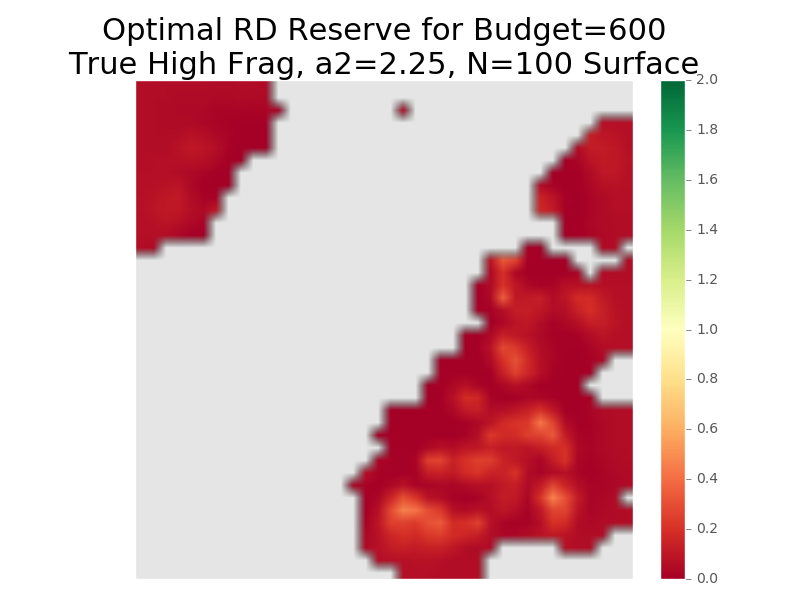

# scropt
**S**patial **C**apture-recapture **R**eserve **OPT**imization. Wildlife reserve design based on conservation objectives derived from spatial capture-recapture models.


## Setup

This implementation of `scropt` is written for and tested on a Linux cluster (running Rocks 6.1 and Centos 6.3), and relies on the following directory structure:
```
batchQsub.sh
JOBS/
OUTPUT/
SCROPT/
  data/
  output/
    logfiles/
    lpandsolfiles/
    results/
      budget/
      pareto/
  scripts/
singlejob_33
```
## Dependencies
All scripts were written and tested with Python 2.7.6. Make sure you have the following python packages installed:
* numpy
* matplotlib
* [rasterio](https://pypi.python.org/pypi/rasterio)
* [pulp](https://pypi.python.org/pypi/PuLP)

Additionally, you will need to have access to the IBM ILOG CPLEX Optimization solver if you wish to run the optimizations yourself.

## Example
Here's an example of how to run reserve design experiments using `scropt`. Suppose your `SCROPT/scripts/SCRoptRun.py` looks like this:
```python
#!/usr/bin/python
import math, time, csv
import numpy as np
import pulp
import SCRoptExperiment

### Set up an SCRoptExperiment
budgets = [0, 100, 200, 300, 400, 500, 600, 700, 800, 900, 1000, 1100, 1200, 1300, 1400, 1500, 1600]
landscape = 'tru_high_N100_a2225'
objective = 'rd'
experiment = SCRoptExperiment.Budget(budgets, landscape, objective)
jobsdir = "JOBS/"+landscape+"_"+objective
experiment.createjobfile(jobsdir)
experiment.submitjobs(jobsdir)
```
The jobfile written to `JOBS/tru_high_N100_a2225_rd` as a result of running `SCROPT/scripts/SCRoptRun.py` has one problem (corresponding to one budget value) per line, for example:
```
python SCROPT/scripts/scropt.py -objective rd -budget 600 -hrprop 1 -landscape tru_high_N100_a2225 -method cplex
```
In short, this command creates an SCRoptProblem instance, which is an integer linear program for maximizing, in this case, realized density with a budget of 600 pixels for the true, high fragmentation landscape with resistance parameter alpha2 = 2.25 and population N = 100. This ILP is formulated using `pulp` and solved using CPLEX, and the results are stored in `SCROPT/output/results/budget/tru_high_N100_a2225_rd_600.0.txt`.

We can also visualize the conserved pixels in this solution using the `visualize` module in `scropt`. Suppose your `SCROPT/scripts/generateFigures.py` looks like this:
```python
#!/usr/bin/python
import matplotlib.pyplot as plt
plt.style.use('ggplot')
import visualize

visualize.optimalreserve('tru_high_N100_a2225', 600, 'rd')
```

